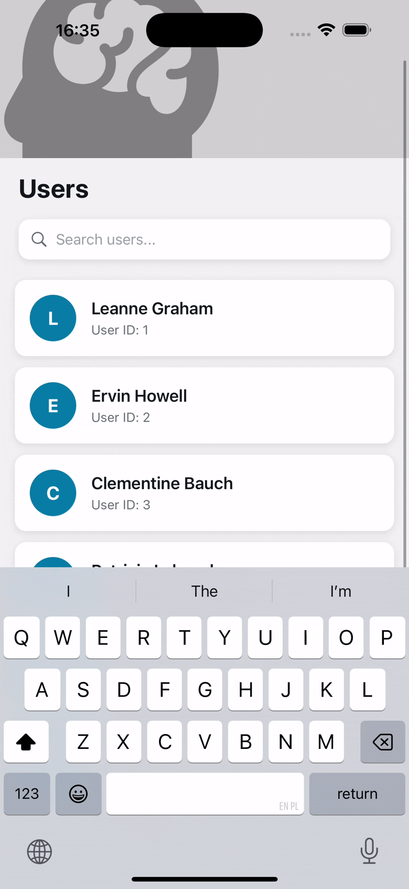

# LeoVegasUK Native Candidate Task

This is a butchered version of an [Expo](https://expo.dev) project created with [`create-expo-app`](https://www.npmjs.com/package/create-expo-app).

Fire up the app for details of the test task 🦁

## Get started

1. Install dependencies

   ```bash
   npm install
   ```

2. Start the app

   ```bash
    npx expo start
   ```

In the output, you'll find options to open the app in a

- [development build](https://docs.expo.dev/develop/development-builds/introduction/)
- [Android emulator](https://docs.expo.dev/workflow/android-studio-emulator/)
- [iOS simulator](https://docs.expo.dev/workflow/ios-simulator/)
- [Expo Go](https://expo.dev/go), a limited sandbox for trying out app development with Expo


## Changes Summary

### Bugs & Performance optimisation

- Identified and fixed an issue where network requests were sent endlessly (_found using DevTools network tab_);
- Moved `renderItem` into a `useCallback` to prevent unnecessary function recreations on each render;
- Used `useMemo` for filtered users to ensure recalculation only when `query` or `users` dependencies changed;
- Updated `keyExtractor` to avoid using the array index as a `key` to prevent confusing bugs during list reordering;
- Moved `FlatList` out from `ScrollView` to prevent nested virtualized list issues;
- Added performance props for `FlatList` to optimise it:
  - `removeClippedSubviews` – _removes views outside the visible area_;
  - `maxToRenderPerBatch` – _controls how many items rendered per batch_;
  - `windowSize` – _defines how many screen length to keep rendered_;
  - `initialNumToRender` – _items rendered on initial load_;
  - `updateCellsBatchingPeriod` – _delay between batched updates_.

### Code quality

- Added `ESLint` and `Prettier` for consistent code style and to catch potential issues in advance;
- Created an API layer to separate the **Data Access Layer (DAL)** from the **UI layer**, keeping components focused on rendering layout.

### UI improvements

- Created `ParallaxFlatList` component with animated header;
- Added `useParallax` hook for a consistent parallax behavior across scroll components;
- Enabled layout animations in `FlatList` for better UX;
- Updated parallax animation to prevent text overlapping with native status bar;
- Supported `Colors` module for a consistent light and dark theme.

## Demo

<table> 
  <tr>
    <td></td>
    <td></td>
  </tr>
</table>
